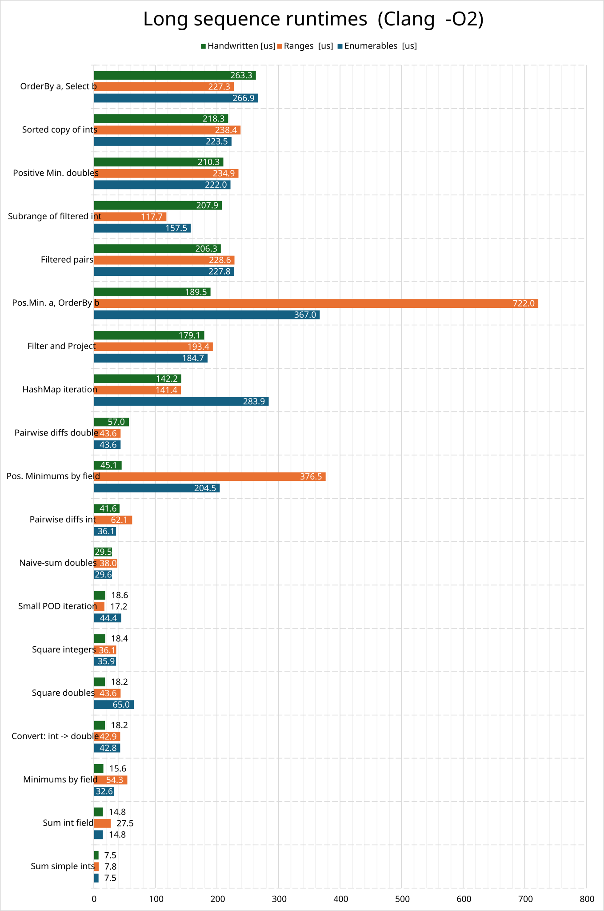
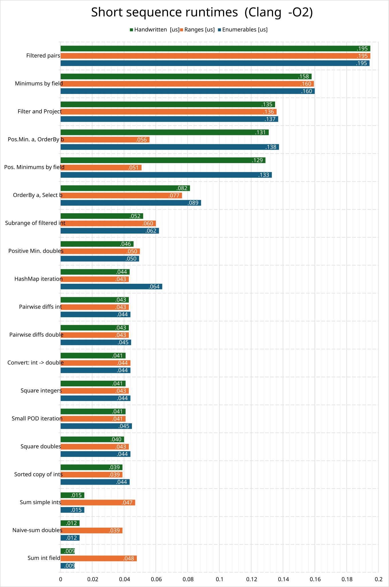
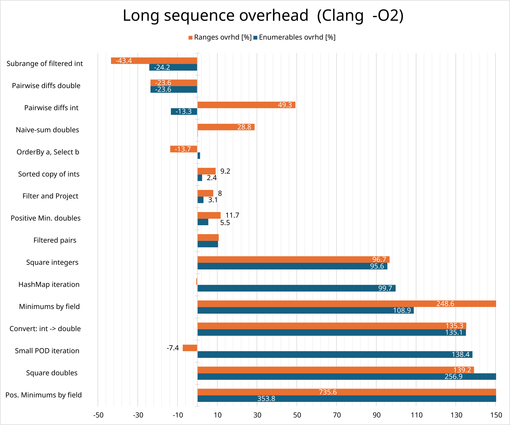
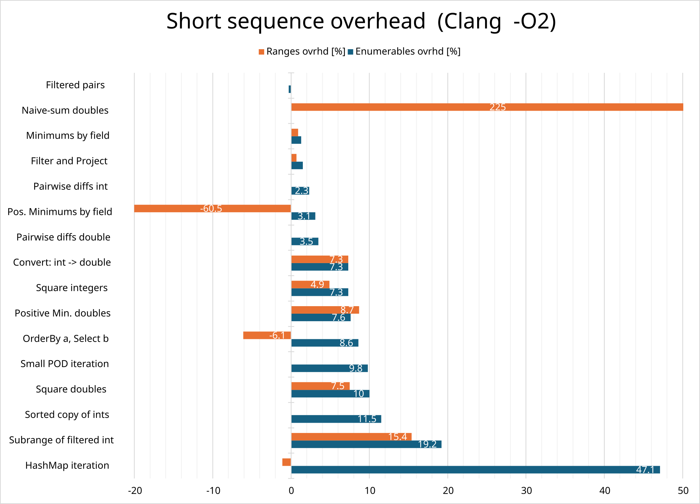
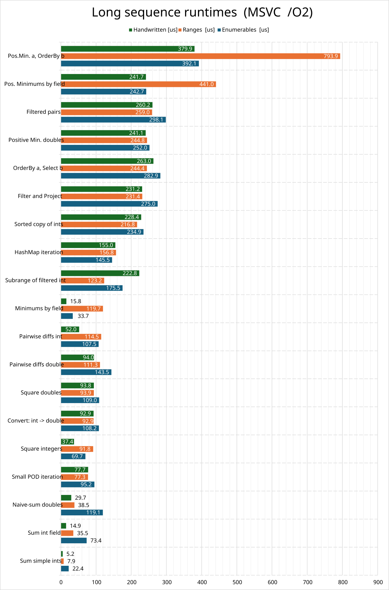
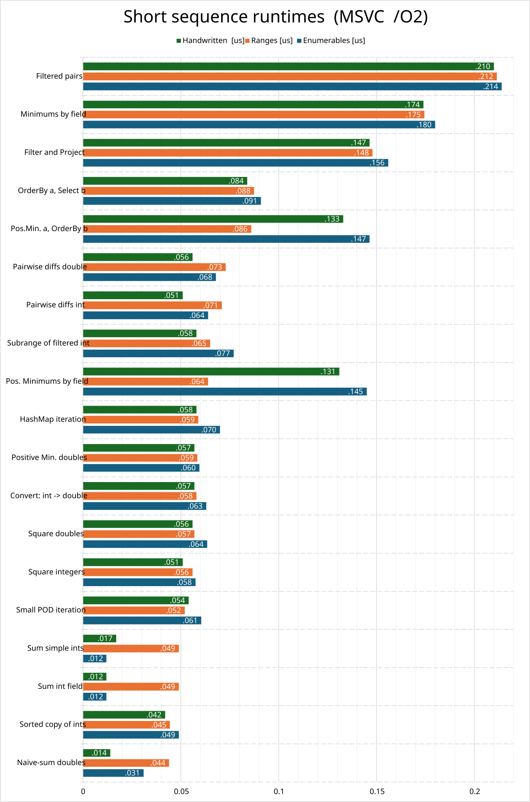
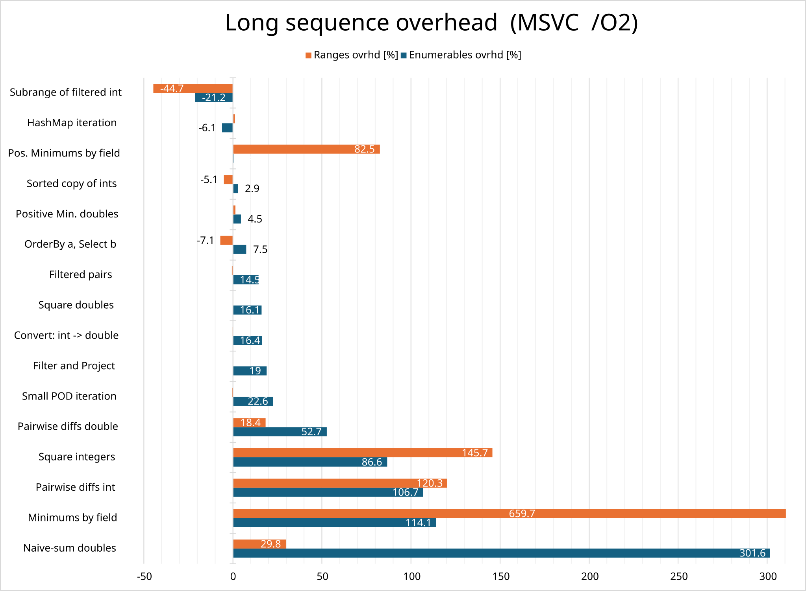
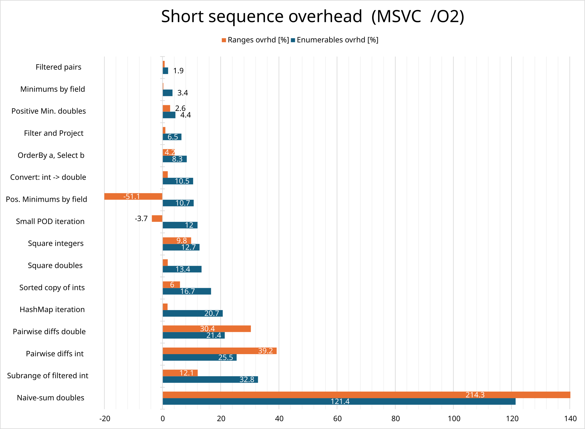

# Enumerables for C++

This header-only library aims to bring the features of .Net's Linq library to C++14 (and newer),
to enable a more declarative / functional coding style.

> &#9888; *The **master** branch preserves **compatibility with C++14.** \
> &emsp;&ensp;&thinsp;Unless being constrained by an old compiler, the recommended branch is clean17!*


### Key sections:
- [Principles](#principles)
    - [Limitations](#limitations)
- [Features](#features)
    - [Type-erased sequences &ndash; Enumerable\<T\>](#type-erased-sequences--enumerablet)
    - [Fully templated sequences](#fully-templated-sequences)
    - [Capture rules](#capture-rules)
    - [Chainable operations](#chainable-operations)
        - [Cached-result optimization](#cached-result-optimization)
        - [Semi-automatic lifetime protection](#semi-automatic-lifetime-protection)
    - [Type argument conventions](#type-argument-conventions)
    - [Overload resolution](#overload-resolution)
    - [Lifetime dependencies](#lifetime-dependencies)
- [Performance](#performance)
- [Setup](#setup)

---
&nbsp;

## Principles

Enumerables provide a common abstraction for various iterable sequences, with an interface that offers fundamental algorithms in a composable form, to manipulate those sequences in a declarative manner. The source of elements can either be a conventional container or some (possibly infinite) generator.
The aim is to follow the original *Linq* conceptually, so that it reads familiar, but also adapt to the peculiarities of C++ programming to stay reasonably efficient.

> &#8505;&ensp;Employing Enumerables offers two main advantages:
>  * declarative style implementation is usually more concise, less error-prone
>  * used on interfaces: it can help to decouple clients from internal structures,\
>    enables functions to consume arbitrary iterable arguments\
>    (albeit this comes with an overhead, see [Type-erased sequences &ndash; Enumerable\<T\>](#type-erased-sequences--enumerablet) vs. [Fully templated sequences](#fully-templated-sequences))

&nbsp;\
This library follows a pragmatic approach with the core objectives of:
 * provide as concise and **fluently readable** syntax as possible
 * have **convenient defaults, deduce types** automatically wherever possible
 * preserve the ability to override those manually
 * **prioritize convenience**, but try to minimize overhead too\
   (keep performance-impacting features optional)
 * depend solely on STL
 * support custom container/exception types in algorithms via **configuration** 

### Limitations
The pragmatism should take form in *sensible limitations* of the scope, not in a low level of attention to details.\
Particularly, the behavior is **unspecified** in the following cases:
 * **volatile** elements
    * forming queries over them is quite questionable
    * much of the internal machinery lacks volatile specializations
* explicit **&& (r-value reference)** elements
    * time of expiry is undetectable (on fetching next item? / after the query ends?)
    * expiring elements should be represented as **pr-values**!\
      (which might not even lead to unnecessary moves in simple cases due to RVO)
 * **const pr-value** elements\
   (although, probably being similar to immutable types)
    * no sense to qualify freshly created objects directly &ndash; the receiver can **const the target variable** at will

(Some basic operations might work over such types as expected, possibly invoking unintended materializations [move/copy] of && elements &ndash; no tests provided.)

> &#9989;&ensp;**In general, the considered element types are:**
> * non-exotic **object types**\
>   (exclude arrays and member-pointers)
> * possibly const-qualified **l-value references** to them.

&nbsp;\
Algorithms might set **additional requirements**\
(these result in clean compile-time errors if not met):
 * **immutable object types** can't participate in **multipass operations**, buffering elements
    * [unless the configured container handles them itself]
    * lvalue-references are supported though, by wrapping them in an *std::ref* fashion internally
    * immutables should work fine in other operations
    > This could be improved in the future.


* On top of this, operations may pose additional requirements only as conceptually necessary to carry them out. (Starting with C++17 even unmovable types are a thing.)
    > &#8505;&ensp;There's a known exception: some complex operations might require copy-constructability in cases when *move* should be sufficient &ndash; there are plans to avoid this.
 

&nbsp;

## Features

### Type-erased sequences &ndash; Enumerable\<T\>

The foundation in .Net is the *IEnumerable\<T\>* interface, implemented by every collection. In place of that,
our *Enumerable\<T\>* is a wrapper, able to hide anything iterable. Automatic conversions are provided:

```cpp
class Registry {
    std::list<Person>          persons;
public:
    Enumerable<const Person&>  Persons() const  { return persons; }
//...
```

Just like in .Net, the *Enumerable* basically represents a query. In the simple case above it stores a reference
to the *persons* list &ndash; meaning that it can be repeatedly evaluated as long as the *Registry* object lives on.
(Modifications will be reflected.)

Querying the **size** is implemented in an **optional-feature** pattern. In such simple cases it is provided in
constant time &ndash; but for a filtered sequence it requires an exhaustive iteration.

```cpp
    Registry  reg;
    /* ... */
    size_t population = reg.Persons().Count();                  // O(1)
    size_t voters     = reg.Persons().Where(isAdult).Count();   // O(n)
```

Behind the scenes, every *Enumerable* is a factory of some *IEnumerator\<T\>* implementor &ndash; which is
a light interface mostly analogous to an input-iterator, just with slightly different requirements.
A type-erased *Enumerable\<T\>* produces a known holder type hiding that concrete implementation.

> &#128712;&ensp;These internals are accessible:
>```cpp
>    Enumerable<const Person&>           query = reg.Persons().Where(isAdult);
>    InterfacedEnumerator<const Person&> etor  = query.GetEnumerator();
>
>    IEnumerator<const Person&>&  iface = etor;  // naturally, an implementor itself
>    while (iface.FetchNext()) {
>        const Person& elem = iface.Current();
>        // ...
>    }
>```


### Fully templated sequences 

The convenience of *Enumerable\<T\>* comes at a cost &ndash; namely virtual calls, and possible allocations in complex cases &ndash;, so it is opt-in. Algorithms that stay within function scope can (and **should**)
stay in "template-land", working with implicitly typed sequences &ndash; some *AutoEnumerable\<Factory\>* type, staying hidden behind *"auto"*.\
To construct these, the main **entry-point** is the ***Enumerate*** function:
```cpp
    std::vector<int>  vec;
    auto numbers   = Enumerate(vec);               // or:
    auto constNums = Enumerate<const int&>(vec);   // forcing conversion to elements

    for (int& x : numbers) { /*...*/ }

    for (const int& c : constNums) { /*...*/ }
```
Other entry points exist as well, even infinite generators:
```cpp
    auto step7 = Enumerables::Sequence(3u, [](unsigned& a){ a += 7; });

    for (int n : step7) { /*...*/ }    // 3u, 10u, 17u, ... till' break!
```

This way, the *IEnumerator\<T\>* interface is not physically used, merely serves as a *concept* for every implementation. These concrete *Enumerators* get nested directly into each other as templates, no intermediary &ndash; this allows quite some compiler optimizations to happen.

> &#128712;&ensp;The concrete *Enumerator* type of an *AutoEnumerable\<Factory\>* is\
> &emsp;&thinsp;&thinsp;*result_of\<Factory()\>::type*.


### Capture rules

The capture kind of sequence **sources / seeds**, as a general rule, depend on the argument's value category:
 * l-value: **reference capture** => lifetime tied, changes reflected
    * e.g.&nbsp; `Enumerate(vec)` &nbsp;/&nbsp; `Enumerables::Once<int>(x)`
 * r-value: **value capture** => the Enumerable is self-contained
    * e.g.&nbsp; `Enumerate({ 1, 2, 3 })` &nbsp;/&nbsp; `Enumerables::Once<int>(5)`
    * output options are limited: mutable T& is forbidden, as the Enumerable itself is logically immutable\
   e.g.&nbsp; `Enumerables::Once<const int&>(5)` &nbsp;is possible, although has caveats

> &#8505;&ensp;Notable exception is the *Enumerables::Range** family of constructors: those resort to plain value parameters anyway, which feels to be the more natural (expected) behavior for those basic functions.

\
**Ordinary numbers** affecting algorithms are simply copied.
 * e.g.&nbsp; `Enumerables::Repeat(x, 6)` or `Enumerables::Repeat(x, count)`\
   Note however, that the seed *x* is taken by a universal reference, and is ref-captured being an l-value!\
   Either *6* or *count* goes to an ordinary size_t parameter, saved by value.

\
**Lambdas** have fine control over captures within themselves, so they are always stored by value.\
(Naturally, this applies to named callables as well.)

&nbsp;

### Chainable operations

Like in .Net, transformation steps can be layered on top of each other in a builder style (utilizing move-semantics wherever possible).\
For that to be readable, it is fortunate to have a concise lambda syntax (like C#'s `x => f(x)`), but C++ lambdas do not excel in that.
The closest thing I could come up with is a pair of macros, abbreviating the most generic lambdas available in C++:
 * one for value-, one for ref-capture (***FUNV*** and ***FUN*** respectively)
 * forwarding-reference parameters
 * decltype(auto) result

These are controversial for many C++ devs, and optional to use, but I found them much more handy and readable than their expanded form.
```cpp
std::vector<Person> persons = /*...*/;

Enumerable<std::string&> adultNames = Enumerate(persons).Where (FUN(p,  p.GetAge() >= 18))
                                                        .Select(FUN(p,  p.GetName()));
// alternatively:
Enumerable<std::string&> adultNames2 = Enumerate(persons).Where ([](const Person& p) { return p.GetAge() >= 18; })
                                                         .Select(&Person::GetName);
```

As illustrated above, member-pointers in C++ can also give some remedy against long lambdas (imagine the trailing return type for refs!), but
having FUN can provide a uniform look and logic-focused code even when some steps require more complex expressions.

Member-pointers play nice in simple tasks:
```cpp
struct Measurement {
    unsigned    sensorId;
    short       value;
    bool        isOfficial;
    long long   time;
};

std::vector<Measurement> measurements = /*...*/;

std::vector<Measurement*> recordsByTime = Enumerate(measurements)
                                            .Where     (&Measurement::isOfficial)
                                            .Addresses ()
                                            .MaximumsBy(&Measurement::value)
                                            .OrderBy   (&Measurement::time)
                                            .ToList    ();
```

#### Cached-result optimization

The previous example also demonstrates an optimization feature: since *MinimumsBy* and *OrderBy* need a result cache (a vector) to work with,
of the exact same type as what's requested by ToList in the end, that cache can be passed down as a whole to ultimately become the
requested result &ndash; which means 0 memory overhead compared to a handwritten algorithm!

This is the fortunate case though. To exploit this feature, one should carefully order the chained operations and adjust the element type to fit the result.
However, it's easy to conceptualize what happens: whenever operations that represent multipass algorithms are followed by each other (or a container materialization, like *ToList*),
elements can pass down the pipeline not only one-by-one, but also at once, as the whole cache container.
(Of course, any subchain of operations can share a cache this way, this is not specific to closing with *ToList*.)


#### Semi-automatic lifetime protection

During transformation steps the goal is to use references whenever possible (to avoid copies + preserve object identity). The *FUN* macros are defined in that mindset:
accessing a field in their body makes the compiler deduce a reference return type. Member-pointers behave the same way by standard. In most cases this is desired &ndash; except when the parameter is an expiring object,
and its subobject is to be selected to continue down the pipeline. This case a pr-value must be materialized.


This can be automated only partially: the parameter's value-category is well known, as well as the result's ref-ness &ndash; but how could the compiler know whether the resulting reference points to something
tied to the input object, or living somewhere outside of it? (A getter may return a reference to something in a parent object, or even in a static table!)

For this reason, the fundamental elem-transformation has 2 forms. The programmer should express intent by choosing:
 * ***.Select*** to expand a subobject
 * ***.Map*** / ***.MapTo*** to apply a general transformation with freely deduced / specified result type\
  (*MapTo\<T\>* got a separate name merely for grammatical clarity.)

 ```cpp
class Pet {
public:
    const Person&       Owner() const;
    const std::string&  Name()  const;
    // ...
};

Enumerable<Pet&>  pets   = /*...*/;
Enumerable<Pet>   copies = pets.Copy();

// Declaring Enumerable<T>-s on lhs only to visualize deduced element types
// - should just use "auto"!

Enumerable<const std::string&>  names1 = pets.Select(&Pet::Name);     // subobject addressable
Enumerable<std::string>         names2 = copies.Select(&Pet::Name);   // must materialize!

Enumerable<const std::string&>  names3 = copies.Map(&Pet::Name);      // compiles, but dangling if executed!
Enumerable<const Person&>       owners = copies.Map(&Pet::Owner);     // OK, desired!
```


An explicit result type can be specified in both cases &ndash; which acts as a return conversion, and can be used to force materialization as well.
 ```cpp
 Enumerable<std::string>  names4 = pets.Select<std::string>(&Pet::Name);       // OK, requested pr-values
 Enumerable<std::string>  names5 = pets.MapTo<std::string>(&Pet::Name);
 Enumerable<std::string>  dangling = copies.Select<std::string&>(&Pet::Name);  // Compile Error
```

Fortunately, the intention of lambdas in more complex operations tends to be more obvious, so this duality has not arisen elsewhere yet.


### Type argument conventions

#### Explicit element types

Since accessing the current item is done via a method call (*.Current()* ) in every Enumerator, a return conversion, like in *.MapTo\<R\> / .Select\<R\>*, can be added to any of them as a "free" operation (in contrast to using a separate conversion step, like *.As\<R\>()* ).

In C++ this is especially useful for adjusting just the qualifications of the resultant element type (add const before ref, or materialize elements by removing ref).

Typically, constructor functions and transformational steps dedicate their **first type-parameter** to this explicit output type, which is optional. (It defaults to *void*, which implies using the deduced output type.)

>&#8505;&ensp;In a few cases, like *Map* vs. *MapTo\<R\>*, the explicitly typed version has a modified name for readability, instead of using an optional parameter.

```cpp
 int arr[] = { 1, 2, 3 };

 auto  asConst1 = Enumerate<const int&>(arr);
 auto  asConst2 = Enumerate(arr).AsConst();   // yields equivalent, but 2 nested steps
 
 auto  prvalues1 = Enumerate<int>(arr);
 auto  prvalues2 = Enumerate(arr).Decay();    // again
```
 In some cases, this explicit element type can be necessary to resolve ambiguities (particularly for heterogeneous *Concat* or initializer-list usage):

```cpp
 short last = 5;
 auto snums = Enumerate<short>({ 3, 4, last });  // int literals

 Derived1 objArr1[] = { /*...*/ };
 Derived2 objArr2[] = { /*...*/ };
 auto catObjects = Enumerables::Concat<Base&>(objArr1, objArr2);
```


Filtration steps, on the other hand, lack such option for output conversion out of conceptual reasons &ndash; and often they utilize type arguments for other purposes instead.

#### Container options

Preconfigured container types may be instantiated in various contexts:
 * as a **direct materialization** of the query results:
   * *.ToList\<ListOptions...\>()*
   * *.ToList\<N, SmallListOptions...\>()*\
     [ requires a configured *SmallList\<size_t, class\>* type ]
   * *.ToSet\<SetOptions...\>()*
   * *.ToDictionary\<DictOptions...\>()*
   * [and further variants]

 * internally, as an **integral part of some algorithm**:
   * *.Except\<SetOptions...\>(exclusions)*
   * *.Intersect\<SetOptions...\>(allowed)*
   * etc.
   
   In these methods the options influence the results directly!\
   (Typically hashers and comparers.)

 * internally, as a **general buffer** [List] for an algorithm 
   * *.Maximums\<Comparator\>()*
   * *.Order\<Comparator\>()*
   * etc.

In the first 2 kinds, the optional type arguments of the containers (those usually follow the element type) are exposed directly to the Enumerable's method, as a variadic type parameter. This way the library can be employed flexibly with many kinds of containers &ndash; as a prime example, one can configure it to use tree-sets, others to use hash-sets:
```cpp
    std::unordered_set<Person, PersonHasher, std::equal_to<Person>> distincts = personsQuery.ToSet<PersonHasher>();
```
&emsp; or
```cpp
    // having a non-default config
    std::set<Person, NameThenIdOrder> orderedDistincts = personsQuery.ToSet<NameThenIdOrder>();
```

Such type-arguments are default-constructed, and passed to the container as configured.

Alternatively, all of these methods are callable with instances of these arguments &ndash; should they include some stateful container option. (However, the two styles can't be mixed within a call.)
```cpp
    auto distincts = personsQuery.ToSet(0, [](const Person& p) { return p.GetHash(); });
    //                                  ^--- sizeHint argument preceeds the container options
    // auto == std::unordered_set<Person, <lambda-type>>
```

&nbsp;\
In contrast, methods of the last kind only provide fixed arguments, specific to the given algorithm (e.g. a comparator; independent from the container type). They instantiate their buffer (a *ListType*) in default configuration.

### Overload resolution

As shown already, member-pointers can present a convenient, *C++*\-native way to express simple lambdas &ndash; as long as the identifier denotes an exact member, not an overload-set. At the same time, in C++ it is extremely common to overload getters by different qualifiers (most often *const*). The default solution of the language requires the definition of a variable of the exact type of the expected method-pointer to select the correct overload &ndash; which is even more cumbersome than using a standard lambda.

Fortunately, an *Enumerable* knows the exact type of its elements, including their qualifiers. Based on this, the accepted set of signatures can be narrowed, and the one having exact match in qualifiers can be preferred.
Unfortunately though, the return type can't be deduced on its own, even if it would be exact after these restrictions. 

The library solution is to ask the user for **explicit return type**, just like if a return-conversion were wanted. That, together with the element type is usually enough to resolve the overload of a getter-like method &ndash; yet, expressing the full method-pointer type can be avoided.
```cpp
    std::string names[] = { "Aldo", "Bruno", "Chiara" };

    auto initials = Enumerate(names).Select<char>(&std::string::front);
    auto initRefs = Enumerate(names).Select<char&>(&std::string::front);

  // compile-time error:
  // auto initials = Enumerate(names).Select(&std::string::front);
```
The caveat is that the resolution requires the exactly qualified return type, which might not meet the desired output element type.
As a bit of help, the library supports specifying either the **exact**, or the **decayed** return type as output. In the latter case, the qualifiers of the input element are implicitly added for the resolution, solving the selection of typical getters.

### Lifetime dependencies

Naturally, the lifetime of input objects must be considered when using Enumerables. The query object becomes invalid if any of its dependencies get destroyed, or left in a moved-out state.
Used within function scope, this typically poses no risk. However, one should pay attention returning *Enumerables* as function results!

The dependency-set of an *Enumerable* consists of:
 * Ref-captured initial arguments (l-value *seeds / sources*)
 * Ref-captured variables of any lambda used in the chain of operations\
   (typically variables named in FUN)
 * Dependencies of joined secondary sequences\
    e.g.&ensp;*.Zip(other)*, *.Concat(other)*, *.Except(other)*:
    * if the operand is another Enumerable -> its whole dependency-set\
     (but not that Enumerable object itself)
    * if the operand is any other iterable l-value (a container reference) -> the iterable itself

*Enumerables* never refer each other. They serve as a builder interface to compose the wrapped Enumerator-factories &ndash; which are always moved or copied as a whole.

```cpp
std::vector<Person> vec;
const minAge = 20;

auto olders1 = Enumerate(vec).Where(FUN(p,  p.GetAge() >= minAge));
auto olders2 = olders1;

auto acceptedNames = olders2.Select(&Person::GetName);
// still depends on: vec, minAge
```

When returned by class methods, it's rather natural that a query can depend on fields &ndash; i.e. on the issuer object itself. However, take care if criteria or a transformation uses locals. FUNV can help in simple cases.

```cpp
class Registry {
    std::list<Person>          persons;
public:
    Enumerable<const std::string&>  YoungestAbove(unsigned minAge) const
    {
        // FUNV or [=] capture to avoid dangling parameter!
        // => result depends solely on "this"
        return Enumerate(persons).Where     (FUNV(p,  p.GetAge() >= minAge))
                                 .MinimumsBy(&Person::GetAge)
                                 .Select    (&Person::GetName);
    }

//...
```

> &#128712;&ensp;Interacting with *Enumerators* directly:\
A constructed Enumerator is always tied to its creator (the Enumerable). It's only valid until the creator is moved/destroyed. (The Enumerable is logically immutable, posesses any constant resources, while the Enumerator allocates running variables for the algorithms.)


### Further info

The implemented operations are found on the public interface of the *AutoEnumerable* class,\
located in [Enumerables_Interface.hpp](/Enumerables/Enumerables_Interface.hpp)

To have a more detailed overview of the library's features, look at:
 * [Introduction_Fundamentals.cpp](/Tests/Introduction_Fundamentals.cpp)
 * [Introduction_Operations.cpp](/Tests/Introduction_Operations.cpp)
 * [Introduction_Examples.cpp](/Tests/Introduction_Examples.cpp)

 or consult the Tests covering the feature of interest.
> &#128712;&ensp;Some complex operations of .Net, like Join, have not been implemented yet.\
> &emsp;&thinsp;&thinsp;Scan/Aggregate is in an experimental-ish state.


&nbsp;

## Performance

Utilizing *Enumerables* to code in a very C# style (i.e. to return filtered or transformed views of member collections via *Enumerable\<T\>*, or accept
parameters as *Enumerable\<T\>*), while functionally provides great flexibility, can affect performance in various ways.\
It can save a lot of copies and (typically) 1 larger allocation to return the results or to convert the argument into the desired form &ndash;
at the cost of virtual calls during iteration, and 0..2 smaller allocations for the *Enumerable\<T\>* itself, and its interfaced *Enumerator* (both can get inlined depending on their size).
The actual cost of allocations highly depends on the real load on the allocator.

The C++20/23 STL basically offers coroutines to use on such boundaries (assuming non-header-defined functions), which incurs other costs.

Using *Enumerables* in the *"Fully templated"* manner, simply to transform data within function scope, the overhead encountered is much more definite. It can be traced back to one of the following:
* suboptimal implementation of operations
* some structural cost of abstraction (e.g. more passes, inability to reuse resources)
* the compiler's struggling to inline/optimize the chained operations

### Measurements

The primary goal of the [PerfTests](./Tests/PerfTests.cpp) unit is to measure the latter, more "raw" kind of overhead in some basic problems, compared against the handwritten (or the STL *Ranges*) solution.
(Although it can measure the cost of virtual calls too.)

To further "homologate" the testcases, each algorithm variant must pass its result simply in a materialized std::vector (except in aggregation tests, where it is a scalar)
&ndash; thus, the cost of creating a vector is always included, but we won't compare apples to oranges.\
Testcases are run for **short** (\~10 elements) and **long** (10000+ elements) sequences separately.

The following charts show these results measured with [v2.0.3-PerfCheck](https://github.com/feketedev/EnumerablesCpp/releases/tag/v2.0.3-PerfCheck) for testcases having a *ranges* variant, compiled for **x64** in **C++23** mode.

Some *ranges* implementations have some caveats though, for not having fully equivalent operations in every case:
 * Minimum/Maximum place searches:\
   The canonical way would have to loop over iterators, repeatedly calling *min_element* &ndash; which I considered too close to the handwritten style, so I used a 2-pass method,
   using *min* and *views::filter*, as a way to avoid manual loops. \
   (Favors *Ranges* for short, *Enumerables* for long sequences)
 * Integer summation\
   Uses fold, whereas *Enumerables*' *.Sum* has a loop.\
   (Favors *Enumerables*) \
   [*"Naive-sum doubles"* is valid, as the *Enumerables* version also uses *.Aggregate*!]
 * Sorted results\
   *ranges::sort* modifies a *vector* copy, whereas *.Order / .OrderBy* provides a lazy, updatable view \
   (Favors *Ranges*)

*It might be worth mentioning too that the whole solution is Visual Studio based, so the Clang version compiles with MS STL as well.*

The whole test-suit ran 10 times on an i7-14700K, with all Turbo, SpeedStep and SpeedShift functions disabled, clocked at 3.4 GHz. The diagrams present the median runtimes.


<details open>
<summary>Clang Runtimes</summary>

   \
  

</details>

<details>
<summary>Clang Overhead comparison</summary>

  \
  **-- Note that extreme cases are off the chart to visualize the rest. --**

  

</details>

<details>
<summary>MSVC Runtimes</summary>

  \
  

</details>

<details>
<summary>MSVC Overhead comparison</summary>

  \
  **-- Note that extreme cases are off the chart to visualize the rest. --**
  

</details>

### Conclusions

If we exclude the problematic testcases (minimum searches, integer summation), the rest shows an overhead pretty close to that of *Ranges*.
In fact, the cumulated overhead (for running all testcases 1 time) of *Enumerables* against going handwritten is around **13%** on *MSVC*, **26%** on *Clang*.
(Personally, I can argue that - especially the former - is an acceptable price for the abstraction.)

With the problematic or unsupported testcases excluded, *Ranges* performs undeniably better, by around 15% on each compiler.

Some observations:
 * *"Subrange of filtered int"* always performs worst in handwritten version.\
   This is because I missed the early-exit opportunity for having 1 branch only.\
   (At least both libraries do it right.)
 * *"Naive-sum doubles"* aka. *fold* vs. *Aggregate* is interesting, the compilers optimize it differently with drastically opposite results.
 * *"Hashmap iteration"* shows no problem under MSVC, yet significant handicap under Clang.


&nbsp;

## Setup

* **Copy** the *Enumerables* folder as a whole to your project
* Based on [Enumerables.hpp](/Tests/Enumerables.hpp) create **your own config file** (of the same name),\
  which will ultimately include *Enumerables_Implementation.hpp* to instantiate the library
    * Internal usage of non-standard container types can be configured there via some macros and simple binding classes
    * Performance and Debug features can be tweaked via some macros
    * Find available options in [Enumerables_ConfigDefaults.hpp](/Enumerables/Enumerables_ConfigDefaults.hpp)
* **Include** that *Enumerables.hpp* in client code
* Provide ***GetSize(container)*** function overloads (see [Extensibility/Input containers](#input-containers))
    * for any utilized input container type &ndash; to ensure efficiency
    * for configured custom internal containers &ndash; as a requirement!
    
* Loading [Enumerables.natvis](/Enumerables/Enumerables.natvis) to Visual Studio can help debugging.

## Extensibility

The builder-style composition has the drawback that it requires a monolith interface. Since C++ doesn't have extension methods, nor an accepted UFCS proposal
(like N4474), adding extra operations currently requires adding them directly to the *AutoEnumerable* class (while the algorithms themselves can be defined
freely anywhere, in the form of *IEnumerator\<T\>* descendants).

The theoretical benefit is that a good intellisense can provide method completion after each period hit, because deduction "flows" simply downwards
(in contrast to a piping syntax). The real one does struggle though &ndash; hopefully, C++20 concepts will help on that, once utilized.

> It should be possible to define extended descendants with some CRTP support &ndash; this possibility is unexplored.


### Input Containers

Naturally, any range-iterable type can serve as the source of a sequence.\
Querying their size however does not have a standard way before C++17.

The client is allowed to overload 2 functions in the library's namespace:
* size_t *Enumerables::GetSize*(const Container&)
    * To achieve the best possible performance, in C++14 it is advised to overload for all encountered containers!
* bool *Enumerables::HasValue(const Optional&)*    
    * Required for a custom optional type if set by binding
    * Enables convenience methods *(.ValuesOnly)* over other optional-like types

Alternatively, these overloads can be provided via ADL, without touching *Enumerables*.

### Created Containers

As mentioned in *Setup*, it is also possible to configure custom container types to be used throughout the library: both by the internal implementation of algorithms, and as the output of some terminal functions *(ToList / ToSet / ToDictionary)*.

This is done through a few macros, and user-defined binding classes that consist of simple static methods for the basic operations.
For example, to use *std\::set* instead of the default *std::unordered_set*, one could use the following config in his *Enumerables.hpp*:

 ```cpp
#include <set>

#define ENUMERABLES_SET_BINDING  MyConfig::TreeSetOperations

namespace MyConfig {
    struct TreeSetOperations {

        template <class V, class... Options>
        using Container = std::set<V, Options...>;

        static constexpr unsigned AllocatorOptionIdx = 1;


        template <class TContainer, class... Opts>
        static TContainer    Init(size_t /*capacity*/, const Opts&... options)
        {
            return TContainer (options...);    // no option to .reserve(capacity)
        }


        template <class V, class... Opts>
        static bool    Contains(const Container<V, Opts...>& s, const V& elem)
        { 
            return s.find(elem) != s.end();
        }

        template <class V, class... Opts, class Vin>
        static void    Add(Container<V, Opts...>& s, Vin&& elem)
        {
            s.insert(std::forward<Vin>(elem));
        }
    };
}
// GetSize can be overloaded for any input containers as well, to enable O(1) size hints!
namespace Enumerables {
    template <class... Args>
    size_t GetSize(const std::set<Args...>& s) { return s.size(); }
}

// -- Instantiate the library after all config. --
#include "Enumerables_Implementation.hpp"
```

Of course, in this case, any set-using operations (e.g. *.Except / .Intersect*) will expect a Comparator, instead of the Hasher and EqualityComparer of the default *std::unordered_set*.


> &#8505;&ensp;Currently this is a config-level customization only. Due to ODR this means that &ndash; while the library can be tailored for usage with any project's ecosystem &ndash; each module (.exe or .dll) can only have 1 such configuration in effect!

> The alternative could be the introduction of additional template parameters for those binding (or strategy) classes.
> This idea is yet to be explored.

&nbsp;

## Maturity status

The original (let's say 1.0, but rather 0.9) version was utilized in an old project (from which the C++14 requirement originated), where it was part of production code. Therefore, the core concepts are battle-proven.

However, that version relied heavily on the usage of *std\:\:function*, which really added overhead in exchange for simplifying the code. I collected many improvement ideas during that time (including fully templating the code to avoid *std\:\:function*).\
Lately, I had time to polish them, find new ones, and reorganize the interface to make it consistent.

Hence this is version 2.0 (with one sole usage of *std\:\:function*, for type-erasure).
Keep in mind that this version has much greater complexity, yet is not actively used at the moment. The only coverage is provided by the uploaded tests &ndash; many of them became quite comprehensive though!

(Fortunately, errors usually manifest in compilation errors, so large surprises should be unexpected \:\) )


## Copyrights

This code is released under MIT license. See [LICENSE.txt](LICENSE.txt).\
Copyright 2024-2026 Norbert Fekete.
